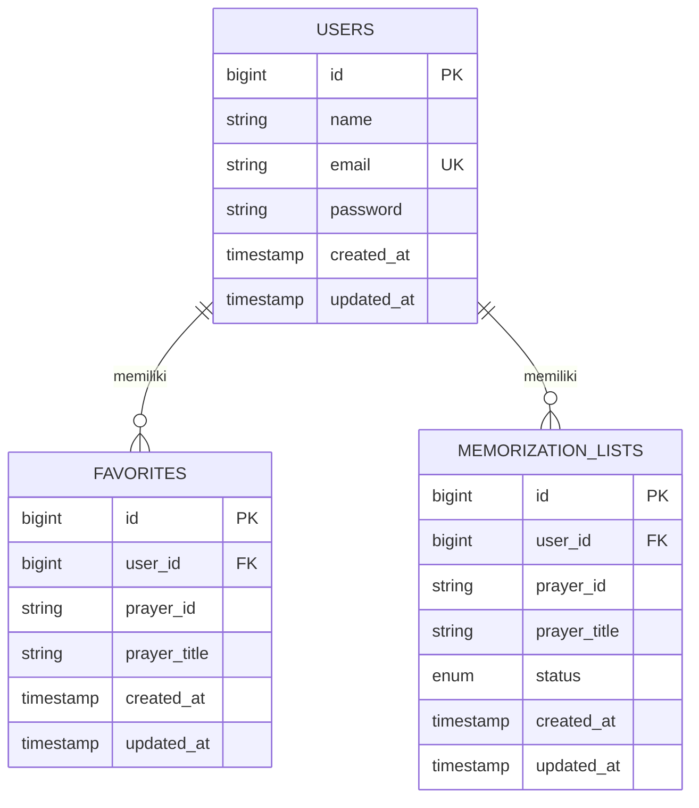

# Product Requirement Document (PRD) — Contract Interface & Database Design

**Proyek:** DoaKu Kids  
**Versi:** 1.0  
**Tanggal:** 18 Juni 2026  
**Status:** Draft / Proposed  
**Penulis:** Kelompok 1 (Backend & Frontend)

---

## 1. Pendahuluan

Dokumen ini mendefinisikan **Contract Interface** (kontrak layanan API dan interface di level kode Laravel) serta **Rancangan Database** untuk proyek **DoaKu Kids**. Tujuannya adalah memastikan integrasi yang mulus antara backend Laravel, frontend Laravel Blade (monolitik), database MySQL, serta layanan pihak ketiga (Public Doa API).

Dengan mendefinisikan interface dan schema database sejak awal, pengembang frontend dan backend dapat bekerja secara paralel dengan pemahaman yang sama terhadap model data dan alur data.

---

## 2. Rancangan Database (Database Schema)

Aplikasi **DoaKu Kids** menggunakan database relasional MySQL. Karena data doa diambil langsung secara real-time dari Public Doa API, database internal sistem difokuskan untuk mengelola autentikasi pengguna, daftar doa favorit, dan daftar progres hafalan doa.

### 2.1 Entity Relationship Diagram (ERD)

Berikut adalah struktur hubungan antar tabel di database sistem:



### 2.2 Struktur Tabel Detail

#### 2.2.1 Tabel: `users`
Menyimpan informasi data akun pengguna (anak/orang tua).

| Nama Kolom | Tipe Data | Atribut | Deskripsi |
| :--- | :--- | :--- | :--- |
| `id` | BIGINT | PK, Auto Increment | ID unik user. |
| `name` | VARCHAR(255) | Not Null | Nama lengkap user. |
| `email` | VARCHAR(255) | Not Null, Unique | Alamat email user untuk login. |
| `password` | VARCHAR(255) | Not Null | Password yang di-hash (Bcrypt). |
| `remember_token` | VARCHAR(100) | Nullable | Token sesi "remember me" Laravel. |
| `created_at` | TIMESTAMP | Nullable | Waktu pendaftaran akun. |
| `updated_at` | TIMESTAMP | Nullable | Waktu pembaruan data akun. |

#### 2.2.2 Tabel: `favorites`
Menyimpan referensi doa-doa yang difavoritkan oleh user.

| Nama Kolom | Tipe Data | Atribut | Deskripsi |
| :--- | :--- | :--- | :--- |
| `id` | BIGINT | PK, Auto Increment | ID unik entri favorit. |
| `user_id` | BIGINT | FK (users.id), Not Null | Referensi ke ID pengguna pemilik favorit. |
| `prayer_id` | VARCHAR(50) | Not Null | ID doa dari Public Doa API (misal: `"1"`). |
| `prayer_title` | VARCHAR(255) | Not Null | Judul doa yang dicache agar frontend tidak perlu fetch ulang API untuk sekadar menampilkan list. |
| `created_at` | TIMESTAMP | Nullable | Waktu ditambahkan ke favorit. |
| `updated_at` | TIMESTAMP | Nullable | Waktu pembaruan entri. |

* **Constraint Tambahan:** Unique Index pada gabungan kolom `(user_id, prayer_id)` untuk mencegah user memfavoritkan doa yang sama lebih dari sekali.
* **Foreign Key:** `user_id` CASCADE ON DELETE.

#### 2.2.3 Tabel: `memorization_lists`
Menyimpan status progres hafalan doa oleh user.

| Nama Kolom | Tipe Data | Atribut | Deskripsi |
| :--- | :--- | :--- | :--- |
| `id` | BIGINT | PK, Auto Increment | ID unik entri hafalan. |
| `user_id` | BIGINT | FK (users.id), Not Null | Referensi ke ID pengguna pemilik list hafalan. |
| `prayer_id` | VARCHAR(50) | Not Null | ID doa dari Public Doa API. |
| `prayer_title` | VARCHAR(255) | Not Null | Judul doa yang dicache untuk kemudahan rendering list. |
| `status` | ENUM | Not Null | Progres hafalan: `'belum_mulai'`, `'sedang_dihafal'`, atau `'sudah_hafal'`. Default: `'belum_mulai'`. |
| `created_at` | TIMESTAMP | Nullable | Waktu ditambahkan ke daftar hafalan. |
| `updated_at` | TIMESTAMP | Nullable | Waktu perubahan status progres. |

* **Constraint Tambahan:** Unique Index pada gabungan kolom `(user_id, prayer_id)` untuk mencegah redundansi entri hafalan.
* **Foreign Key:** `user_id` CASCADE ON DELETE.

---

## 3. Contract Interfaces (Service Contracts)

Di level arsitektur kode backend Laravel 11, komunikasi data dibatasi menggunakan pola **Service Pattern** dengan **Interface (Contract)**. Hal ini dilakukan untuk mengabstraksi pemanggilan API eksternal dan operasi database internal sehingga mudah ditest atau diganti jika di masa depan terdapat perubahan provider API.

### 3.1 Kontrak Layanan Doa (`DoaServiceInterface`)
Interface untuk mengonsumsi data dari Public Doa API.

```php
<?php

namespace App\Contracts;

interface DoaServiceInterface
{
    /**
     * Mendapatkan semua daftar doa dari public API.
     * 
     * @return array List doa berupa array of objects/associative arrays.
     */
    public function getAllPrayers(): array;

    /**
     * Mendapatkan detail doa berdasarkan ID spesifik dari public API.
     * 
     * @param string $id ID dari doa yang ingin diambil.
     * @return array|null Detail doa (id, doa, ayat, latin, artinya) atau null jika tidak ditemukan.
     */
    public function getPrayerById(string $id): ?array;

    /**
     * Mencari doa berdasarkan kata kunci nama doa.
     * 
     * @param string $doaName Kata kunci pencarian (misal: "tidur", "makan").
     * @return array List doa yang cocok dengan kata kunci pencarian.
     */
    public function searchPrayers(string $doaName): array;

    /**
     * Mendapatkan satu doa acak secara acak (random).
     * 
     * @return array|null Detail doa acak atau null jika gagal mengambil data.
     */
    public function getRandomPrayer(): ?array;
}
```

### 3.2 Kontrak Favorit (`FavoriteServiceInterface`)
Interface untuk memanipulasi data doa favorit pengguna di database internal.

```php
<?php

namespace App\Contracts;

use Illuminate\Support\Collection;

interface FavoriteServiceInterface
{
    /**
     * Menambahkan doa ke daftar favorit pengguna.
     * 
     * @param int $userId ID pengguna yang login.
     * @param string $prayerId ID doa dari Public API.
     * @param string $prayerTitle Judul doa untuk dicache.
     * @return bool True jika berhasil ditambahkan, false jika gagal.
     */
    public function addToFavorite(int $userId, string $prayerId, string $prayerTitle): bool;

    /**
     * Menghapus doa dari daftar favorit pengguna.
     * 
     * @param int $userId ID pengguna yang login.
     * @param string $prayerId ID doa dari Public API.
     * @return bool True jika berhasil dihapus, false jika gagal.
     */
    public function removeFromFavorite(int $userId, string $prayerId): bool;

    /**
     * Mengambil seluruh daftar doa favorit milik pengguna tertentu.
     * 
     * @param int $userId ID pengguna.
     * @return Collection Kumpulan data doa favorit pengguna.
     */
    public function getFavoritesByUser(int $userId): Collection;

    /**
     * Mengecek apakah doa tertentu sudah difavoritkan oleh pengguna.
     * 
     * @param int $userId ID pengguna.
     * @param string $prayerId ID doa dari Public API.
     * @return bool
     */
    public function isFavorited(int $userId, string $prayerId): bool;
}
```

### 3.3 Kontrak Hafalan Doa (`MemorizationServiceInterface`)
Interface untuk melacak kemajuan hafalan doa pengguna di database internal.

```php
<?php

namespace App\Contracts;

use Illuminate\Support\Collection;

interface MemorizationServiceInterface
{
    /**
     * Menambahkan doa ke daftar hafalan pengguna.
     * 
     * @param int $userId ID pengguna.
     * @param string $prayerId ID doa dari Public API.
     * @param string $prayerTitle Judul doa untuk dicache.
     * @return bool
     */
    public function addToMemorization(int $userId, string $prayerId, string $prayerTitle): bool;

    /**
     * Memperbarui status/progres hafalan doa pengguna.
     * 
     * @param int $userId ID pengguna.
     * @param string $prayerId ID doa dari Public API.
     * @param string $status Status progres ('belum_mulai', 'sedang_dihafal', 'sudah_hafal').
     * @return bool
     */
    public function updateMemorizationStatus(int $userId, string $prayerId, string $status): bool;

    /**
     * Menghapus doa dari daftar hafalan pengguna.
     * 
     * @param int $userId ID pengguna.
     * @param string $prayerId ID doa dari Public API.
     * @return bool
     */
    public function removeFromMemorization(int $userId, string $prayerId): bool;

    /**
     * Mengambil daftar progres hafalan milik pengguna tertentu.
     * 
     * @param int $userId ID pengguna.
     * @return Collection Kumpulan data hafalan beserta statusnya.
     */
    public function getMemorizationsByUser(int $userId): Collection;
}
```

---

## 4. Alur Integrasi Antarmuka (Interface Flow)

Untuk mempermudah pemahaman proses kerja, berikut alur interaksi interface pada backend monolitik Laravel Blade:

1. **Halaman Utama (Daftar Doa & Doa Acak):**
   * Controller memanggil `DoaServiceInterface::getAllPrayers()` dan `DoaServiceInterface::getRandomPrayer()`.
   * Data dilempar langsung ke Laravel Blade View untuk dirender sebagai kartu interaktif.
2. **Pencarian Doa:**
   * User mengetik kata kunci di kolom pencarian.
   * Controller menerima query string, lalu memanggil `DoaServiceInterface::searchPrayers($query)`.
   * Hasil pencarian dikembalikan dan ditampilkan ke antarmuka pengguna.
3. **Detail Doa & Favorit/Hafalan:**
   * User mengklik kartu doa. Controller memanggil `DoaServiceInterface::getPrayerById($id)`.
   * Controller juga memanggil `FavoriteServiceInterface::isFavorited($userId, $id)` untuk menentukan ikon bintang/favorit aktif atau tidak di frontend.
   * Progres hafalan diambil melalui `MemorizationServiceInterface::getMemorizationsByUser($userId)`.
